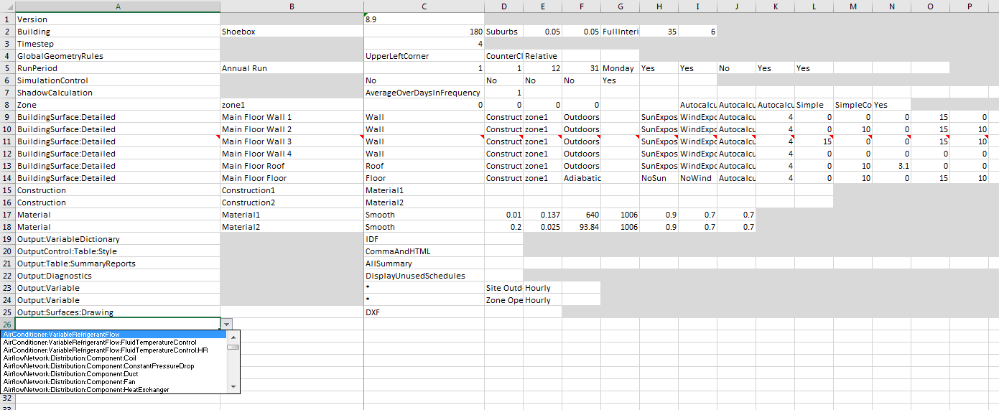
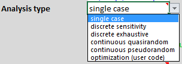
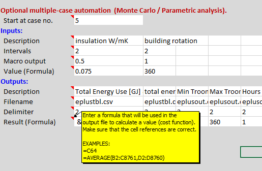
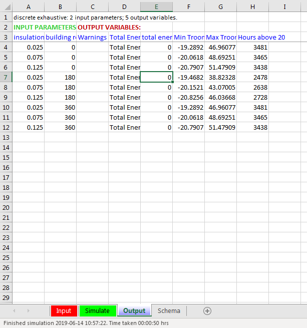
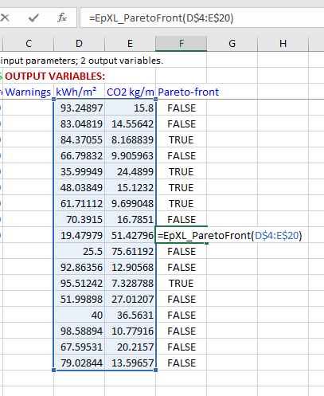
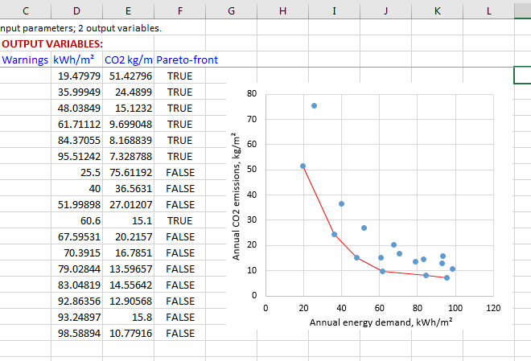

# EpXL  
EnergyPlus-Excel is a simple yet powerful macro-enabled Microsoft Excel spreadsheet user-interface to the EnergyPlus™ whole-building energy simulation program (https://energyplus.net/). It can import .epJSON and legacy .IDF input data files, or you can create/edit from scratch. It gives a compact tabular overview of all input data, which you can manipulate (copy/paste/edit), with popup descriptions. EpXL has numerous automation functions including error checking, parametric analysis, and multi-objective optimization (Monte Carlo with Pareto-front). Output is automatically imported into Excel, with a link for viewing the 3D model.

### Functionality overview
- **Input data is tabulated in a compact form, with popup field descriptions, giving a good overview for editing**
- **Automatic checks for max/min bounds, list options, and value type (numeric or string)**
- **Import/export .epJSON and legacy .IDF input data files**
- **Hyperlinks automatically import results files into Excel, e.g. time-series**
- **Hyperlinks to view 3D model of the building, and airflow network**
- **Multidimensional parametric analysis and and user-definable multi-objective optimization**
- **User functions for psychrometrics and Pareto-front (multi-objective optimization)**
- **Always up-to-date with the latest version of EnergyPlus (schema)**

 'Input' sheet: The leftmost column has a dropdown list of object types

  
### Summary of the main macros
- **CTRL+I**: Import an input data file (.IDF or .epJSON) file to sheet 'Input'.
- **CTRL+Q**: Quality check of the input data in sheet 'Input'.
- **CTRL+E**: Export the input data to a .IDF file or .epJSON*. This is normally not necessary, as the 'Start simulation' button does this anyway.
- **F1** (Help button): Show pop-up comments describing input data fields on selected row of sheet 'Input'.
- The **'Start simulation'** button on sheet 'Simulate' automatically exports the input data file, runs EnergyPlus, reports any errors, and compiles list of list of output files (with hyperlinks). In the case of multiple-case automation, the 'Start simulation' button runs either a discrete number of simulations (parametric/sensitivity analysis) or ad-infinitum (Monte Carlo) until you press the 'Stop' button.
- Clicking on the **hyperlinks** in sheet 'Simulate' opens results for viewing (e.g. .csv files in Excel)
- Viewing the **'Schema'** sheet automatically imports the latest schema "Energy+.schema.epJSON", which and is found in the EnergyPlus root directory on your PC.

(* Outputs epJSON by default. Conditional compilation argument *outputJSON* is defined in **Tools > VBAProjectProperties**: =1 for .epJSON, =0 for .IDF)

### Functionality in detail
- Input data is tabulated in sheet 'Input' (one row per object; one column per input field). The first column contains a drop-down list for choosing the field type. You can copy/paste and use formulae, just as in a normal spreadsheet.
- EpXL is distributed with example input data in the 'Input' sheet, which is a version of the EnergyPlus example buildings. You can safely clear this data (CTRL+A selects the whole sheet, then DELETE key). The import function (CTRL+I) also clears sheet 'Input' before importing the file.
- Key F1 (Help-key) to show popups describing all the input data fields for the current row (object) in the 'Input' sheet. These descriptions can be updated at any time to the latest EnergyPlus schema.

 'Input' sheet: Press F1-key for popup field descriptions in current row

- Key CTRL+I to import any EnergyPlus data file. Both legacy Input Data Files (.IDF) and new .epJSON files can be imported. Immediately after importing the file into sheet 'Input', EpXL vets the data against the JSON schema. After this you can edit the data just like any spreadsheet by inserting or deleting rows and editing cells. Each row is an object type, and each column is an input field. The object types can appear in any order, but fields must appear in the order specified by the schema.
- Key CTRL+Q (for Quality check) any time, to vet the input data in sheet 'Input' against the schema. This checks for missing or superfluous/duplicate object types, missing required field values, out-of-range values, and case-sensitive text options. Incorrect case is corrected automatically for case-sensitive options. This checking is also conducted automatically when you click on the 'Start simulation' button.
- EpXL is distributed with the input data schema (earlier called Input Data Dictionary, IDD) for EnergyPlus v9.1.0 embedded. Whenever a new version of Energy Plus is relased, you can update EpXL to the latest schema by viewing sheet 'Schema', which automatically imports the latest schema (Energy+.schema.epJSON file), or an earlier version of you choose. Save the EpXL workbook after you have done this.
- User functions for psychrometrics to convert between relative humidity, dewpoint temperature and humidity ratio (kg H2O / kg dry air): EpXL_Pws(Ta_K), EpXL_RH1_air(Tair_K, Tdew_K), EpXL_RH2_air(Ta_K, Patm_Pa, HumidRatio_kgkg), EpXL_HumidRatio1_air(Ta_K, Patm_Pa, RH), EpXL_HumidRatio2_air(Tdew_K, Patm_Pa), EpXL_HumidRatio3_air(Ta_K, Patm_Pa, Twet_K), EpXL_Tdew1_air(Pw_Pa), Tdew2_air(Patm_Pa, HumidRatio_kgkg), Tdew3_air(Ta_K, RH)
- To run a simulation, click on button "Run simulation" on sheet 'Simulate'. For "single-case" simulation, EpXL shows a list of hyperlinks to important output files. For multiple-case simulations, EpXL generates a list inputs and outputs for each case in sheet 'Output'.

 Sheet 'Simulate': Press 'Start simulation' button. The most important output files are listed with hyperlinks. Hyperlink for viewing 3D model (.DXF file). The other hyperlinks open files in Excel or text viewers.

- Multidimensional optimization and parameter analysis (multiple-case automation), with simpler yet more flexible functionality compared to [GenOpt](https://simulationresearch.lbl.gov/GO/index.html):
  - Parametric analysis (discrete, either multidimensional or one-at-a-time sensitivity analysis)
    - **Discrete sensitivity**: Sensitivity analysis, i.e. only one parameter is changed (two simulations, with the parameter set to its upper and lower bounds respectively) whilst the other parameters are set to their respective mean values. This is also known as one-at-a-time (OAT) sensitivity analysis.  This involves 2*D simulations where D is the number of parameters. E.g. if there are 3 parameters, then only 2+2+2 = 6 cases are simulated.   
    - **Discrete exhaustive**: This solves all combinations of all discrete values of each parameter. Input the number of discrete intervals (N) below for each parameter. e.g. if there are N intervals for each of D parameters, there will be (N+1)^D simulation cases, so if there are many parameters, the number of cases is huge. If you set the number of intervals to N=1 then only max/min limit values for each parameter will be simulated. e.g. if N=1 and there are 3 parameters, then 2*2*2 = 8 simulations are run.
  - Multidimensional Monte Carlo simulations (low-discrepancy quasi- or pseudorandom) with user-definable input parameters/functions (continuous or discrete). Multiple user-defined cost functions enable the application of multi-objective optimization with a Pareto front. The following two alternatives are available:
    - **Continuous quasirandom**: Values are generated by a quasi-random number generator (The Faure-Lemieux multidimensional low-discrepancy sequence, with up to 360 dimensions [[1](#ref1)]). The sequence is deterministic, i.e. it can be repeated, and you can stop and continue the simulations at any case number. This method is called a "quasi Monte Carlo method", and is generally better than the pseudorandom method below. This the best option for optimization studies as it efficiently gives excellent coverage of the whole parameter domain, increasing the chances of funding the region of the global optimum, as compared to gradient descent optimization algorithms, which can get stuck in local minima.
    - **Continuous pseudorandom**: This is a traditional "Monte Carlo method", with values generated by a pseudo-random number generator, Marsaglia's LFIB4-algorithm [[2](#ref2)]. It passes all Diehard and Big Crush tests, and the ENT-test (Entropy = 7.999989 bits/byte, which is excellent), i.e. equivalent performance to Mersenne Twister. Its period is about 2^287 before repeating. The sequence is randomized with a different seed each time, so simulation results cannot be repeated.
  - For both parametric and Monte Carlo options, you specify both input parameters and output parameters (or formulae for calculating a cost function) in a table at the bottom of sheet sheet 'Simulate'.
  - In the case of multi-objective optimization, user function *epXL_ParetoFront* can be used in worksheet 'Output' to flag cases that on the Pareto front, see figures below:
  

 Automation options (single case, sensitivity analysis, parametric analysis, or different types of Monte Carlo

 Multiple-simulation input/output control in sheet 'Simulate'

 'Output' sheet lists both all the input parameters and output results for each simulation in the case of automated parametric/Monte Carlo analysis

 Example of use of the user function *EpXL_ParetoFront*. Cases on the Pareto front are flagged as TRUE

 Sort all the output rows, using the *EpXL_PareroFront* column as key, to separate out the cases that are on the ParetoFront

  
- EpXL is written in Visual Basic for Applications (VBA), which you are free to edit. One of the routines is dedicated to user-code to modify to automate your own tasks. There are many on-line resources for learning VBA, such as *'Excel VBA for Dummies'* 3rd Ed.
- EpXL checks GitHub for updates when you open the workbook (only if the last time it checked was 2+ days ago). An update message is shown in the splash-screen window. 

### Installation and activation
- Simply download the spreadsheet file and open it in Microsoft Excel. No installation or registration is needed.
- This is a Visual Basic macro-enabled spreadhseet, so you must activate macros for it to function: 
  - When you open the file for the first time in Excel, you will see a yellow bar at the top of the window, with the message *"PROTECTED VIEW Be careful... [Enable Editing]"*. Click on the 'Enable Editing' button. 
  - Next, depending on the security settings on your installation of Microsoft Excel, a red bar may appear at the top of the window, with the message *"BLOCKED CONTENT Macros in this document have been disabled..."*. This can be solved by moving the file to a directory on your PC that you designate for files that you trust, then open the file in Excel. To designate a 'trusted directory', click on **File > Options > Trust Center > Trust Center Settings > Trusted Locations > Add new location**, then browse to a directory, e.g. C:\TEMP\. Finally check that **Trust Center Settings > Trusted Documents > Disable Trusted Documents**  is not ticked.
  - When macros are properly activated, **EpXL** shows a small square splash-screen when you open the file (see image below). This splash screen shows the licence info, and advises you if an update is available for download from GitHub. Simply press 'Close' button to close the splash-screen. 
  - If still no splash-screen appears, then you might be able to fix it by menu option **File > Options > Trust Center > Trust Center Settings > Macro Settings > Disable all macros with notification**, which is a suitable level of security.

 
  Splash screen

### Updating to different versions of EnergyPlus
- First time you use run a simulation in EpXL, a window may appear asking you to browse to thr root directory for EnergPlus on your machine; see the figure below. The root path is then stored in cell B1 of sheet 'Simulate'. Clear cell B1 whenever you want to use a different version of EnergyPlus.
- You should also update the schema, which is stored in EpXL worksheet 'Schema'. Whenever you view sheet 'Schema' you will be asked if you wish to import a different schema. The schema file 'Energy+.schema.epJSON' will then be imported from the current EnergyPlus root directory; see figure below

 Window asking for you to browse to EnergyPlus root path

 Window asking for you to browse to EnergyPlus root path

### License & warranty
- Distributed under the GLP v3 lisence (https://www.gnu.org/licenses/gpl-3.0.en.html). Please acknowledge/attribute use of this software in your report/publication with an appropriate author citation; see the example BibTeX code below.
- Provided without warranty of any kind.

### Author & copyright owner
© Peter.Schild@OsloMet.no

### BibTeX for citing EpXL
@Misc{Schild19, 
  author =   {Peter G. Schild}, 
  title =    {{EpXL}: {EnergyPlus-Excel}}, 
  howpublished = {\url{https://github.com/SchildCode/EpXL/}}, 
  doi = {10.5281/zenodo.3249089} 
  year = {2019} 
} 

### References
[<a name="ref1">1</a>] Faure, H., Lemieux, C. (2009). "Generalized Halton Sequences in 2008: A Comparative Study", *ACM Transactions on Modeling and Computer Simulation (TOMACS)*. Vol.19 No.4, Oct. 2009, Article no. 15

[<a name="ref2">2</a>] Marsaglia, G. "Random Number Generators for C: Some suggestions." Postings in newsgroups sci.math, sci.math.numer-analysis, sci.stat.math, Jan 1999.
